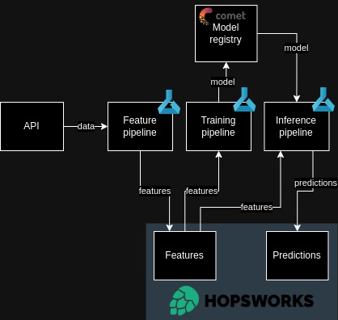

## Project Overview
This project predicts the next day's air quality index (AQI) in Beijing using a daily automated pipeline. The solution incorporates a sequence of feature engineering, training, and inference pipelines to ensure the model leverages the most up-to-date data available. While it demonstrates key machine learning operations (MLOps) best practices, further experimentation is required to enhance model performance. The entire process runs on Azure ML, scheduled via GitHub Actions—suitable for personal projects but scalable systems would require an orchestrator.

#### MLOps Best Practices:

- [x] CI/CD
- [x] Unit tests
- [x] Code quality checks
- [x] Typing
- [x] Modular code
- [x] Version control
- [x] Packaged solution
- [x] Pre-commit hooks
- [x] Model registry
- [x] Feature store

#### Architecture
[FTI architecture](https://medium.com/decodingml/building-ml-systems-the-right-way-using-the-fti-architecture-d9cc0cd29abf) serves  as the basis of the solution. Feature pipeline pulls daily AQI data from an external [API](https://aqicn.org/api/), storing it in a Hopsworks database. The training pipeline retrieves data from the feature store, trains a model, and pushes it to Comet’s model registry. During inference, the prediction pipeline fetches data from Hopsworks, retrieves the trained model from Comet, and stores the resulting predictions back into the database.
Thus the 3 pipelines are decupled can be handled separately and the bridges are the model registry and feature store.

<p align="center">
  
</p>

## Installation and Setup

What you need to run the solution:
1. Services
    - [Hopsworks](https://www.hopsworks.ai/)
    - Azure cloud and ML
    - [CometML](https://www.comet.com/site/)
2. Get credentials for services
    - Token for [AQI API](https://aqicn.org/api/)
    - Hosworks:
        - API key
        - Project name
    - CometML:
        - Project  name
        - Workspace name
        - API Key
    - Azure:
        - Subscription ID
        - Client ID
        - Tenant ID
3. Download historical air quality data from [here](https://aqicn.org/historical/#!city:jiangsu/huaian/beijingnanlu)
4. Load historical data into your feature store

## CICD pipeline
Continuous integration:
1. Fix python version
2. Set up poetry environment
3. Run code quality tests(isort, black, flake8)
4. Run type tests (mypy)
5. Run unit tests
6. Build docker image
    - package the solution into wheel file
    - pip install it into docker
7. Push the image into docker repo

Continuous deployment:
1. Create Azure ML environment from the docker image
## Pipelines at runtime
Schedueler (Github action) will call the follwing commands to run feature, training and inference pipelines. respectively.

```yaml
- name: Run feature pipeline
    run: poetry run python src/run_feature_pipeline.py config.yaml

- name: Run training pipeline
    run: poetry run python src/run_training_pipeline.py config.yaml

- name: Run inference pipeline
    run: poetry run python src/run_inference_pipeline.py config.yaml
```
 Each of the files with the run_ prefix will use the created docker environment to run the following bash command on Azure ML
 ```bash
 feature_pipeline config.yaml  \
            --aqi-token {AQI_TOKEN} \
            --fs-api-key {FS_API_KEY} \
            --fs-project-name {FS_PROJECT_NAME}
```

## Code structure
The project is organized into the following directories and files:

```bash
├── src/                              # Source code for the project
│   ├── core/                         # Code for data ingestion, feature engineering, and preprocessing
│   ├── stages/                       # Pipelines for model training, inference, and optimization
|   |   ├── api_feature_pipeline.py            # Pipeline for fetching features from an API
|   |   ├── batch_feature_pipeline.py          # Pipeline for batch feature processing
|   |   ├── hyperparam_optimization_pipeline.py # Pipeline for hyperparameter optimization
|   |   ├── inference_pipeline.py              # Pipeline for model inference
|   |   ├── training_pipeline.py               # Pipeline for model training
│   ├── run_feature_pipeline.py       # Script to execute the feature pipeline
│   ├── run_inference_pipeline.py     # Script to execute the inference pipeline
│   ├── run_training_pipeline.py      # Script to execute the training pipeline
├── tests/                            # Unit tests for the project
│   └── test_model_class.py           # Tests for the model class functionality
├── requirements.txt                  # Python dependencies for the project
├── README.md                         # Project documentation (this file)
├── config.yaml                       # Configuration file for experiment parameters
├── .github/workflows/                # GitHub Actions CI/CD workflows
├── .gitignore                        # Files and directories to be ignored by Git
├── .python-version                   # Specifies the Python version for the project
├── airq-azure-environment.yaml       # Conda environment configuration for Azure ML
├── Dockerfile                        # Dockerfile for containerizing the project
├── Makefile                          # Makefile for automating tasks (e.g., pipeline runs)
├── poetry.lock                       # Lock file for dependencies managed by Poetry
├── pyproject.toml                    # Project metadata and dependency management using Poetry
├── .pre-commit-config.yaml           # Configuration for pre-commit hooks to enforce code quality
```
## Future work

## Acknowledgements
