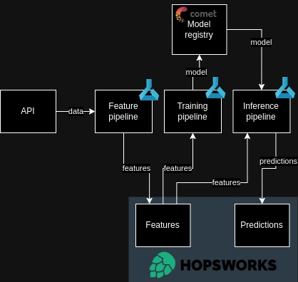

## Project Overview
This project predicts the next day's air quality index (AQI) in Beijing using a daily automated pipeline. The solution incorporates a sequence of feature engineering, training, and inference pipelines to ensure the model leverages the most up-to-date data available. While it demonstrates key machine learning operations (MLOps) best practices, further experimentation is required to enhance model performance. The entire process runs on Azure ML, scheduled via GitHub Actions—suitable for personal projects but scalable systems would require an orchestrator.

### MLOps Best Practices:
- [x] CI/CD
- [x] Unit tests
- [x] Code quality checks
- [x] Typing
- [x] Modular code
- [x] Version control
- [x] Packaged solution
- [x] Pre-commit hooks
- [x] Model registry
- [x] Feature store

### Architecture
The solution pulls daily AQI data from an external API, storing it in a Hopsworks database. The training pipeline retrieves data from the feature store, trains a model, and pushes it to Comet’s model registry. During inference, the prediction pipeline fetches data from Hopsworks, retrieves the trained model from Comet, and stores the resulting predictions back into the database.

